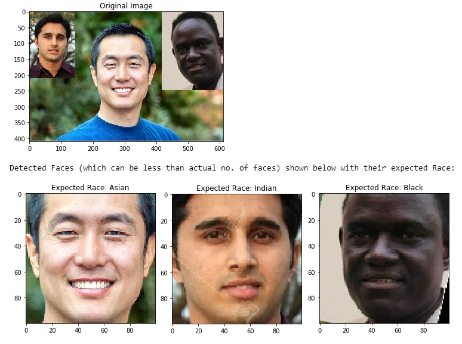
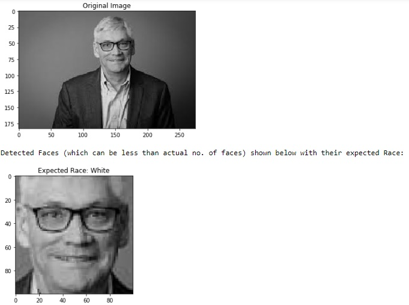

# ML-Ethnicity-Detection
Establish the Ethnicity/nationality of person by just looking at his facial image, if the image is a group photo then extract image of each individual and then classify.
# Requirements
For performing only prediction directly jump to Step 3.
1. (Preprocessing) UTK Face Dataset - Aligned and cropped faces : https://susanqq.github.io/UTKFace/ for performing Preprocessing part (Can be skipped)
 The output of this step: 
a) truncated_X_full.npy is available at:  https://drive.google.com/file/d/1pE16kgV8_qzUTU_py7c_jsaWgN9Sbjvb/view?usp=sharing 
b) truncated_Y_full.npy is available at:  https://drive.google.com/file/d/1qUIkfEOVLmnYAlIRoI0ORRLfXcK2qRXn/view?usp=sharing
2. (Training) For training above two files are required the output of this step is:  
a) The model which is available at:  https://drive.google.com/file/d/1ov2svebfW2gD_qg-Xzvkjjy-_LoSR3Wx/view?usp=sharing
3. (Prediction) For prediction we need  
a) Above trained model available at:  https://drive.google.com/file/d/1ov2svebfW2gD_qg-Xzvkjjy-_LoSR3Wx/view?usp=sharing  
b) landmark file available at:  https://drive.google.com/file/d/1uPuhpCMK9wkzNopUXrbMmzdo6ZxsQd33/view?usp=sharing  
# Files
1) ConvNet.ipynb contains the preprocessing part and training part of CNN.
2) SVM_PCA_NO_PCA.ipynb contains only the training part of SVM and KNN.
3) Prediction.ipynb contains the final outcome of the project in which image is given as input and the output is expected race of the faces detected from the image. 
# Output
1) Image contains three faces of three different races the extracted faces and expected race can be seen in the output.

2) Generally it also works fine with grayscale images as ethnicity is not fully dependent on skin colour.

